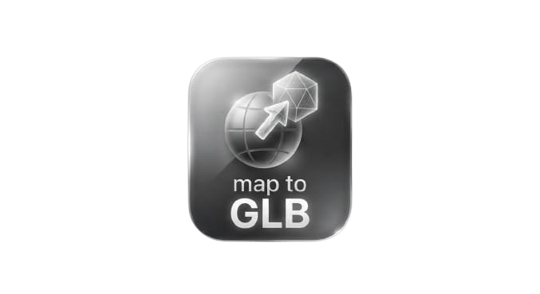
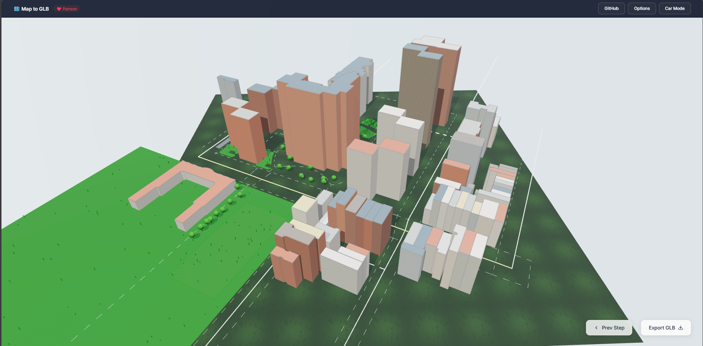

<p align="center">
  
</p>

<h1 align="center">Map to GLB</h1>

<p align="center">
  <strong>Generate real-world 3D maps and export as GLB files</strong>
</p>

<p align="center">
  <a href="https://maptoglb.vercel.app/">Website</a> ·
  <a href="https://github.com/farhanic017/map-to-glb/releases/latest">Download</a> ·
  <a href="https://github.com/farhanic017/map-to-glb/issues">Report Bugs</a> ·
  <a href="https://www.patreon.com/cw/Farhanic">Sponsor</a>
</p>

<p align="center">
  
  
  
  
<a href="https://www.patreon.com/farhanic0"></a>
</p>

---



## Demo


## About

Map to GLB is a 3D building mapping service built with [React Three Fiber](https://github.com/pmndrs/react-three-fiber). Select any area on the map and export real-world buildings, roads, parks, and water features as GLB files for use in games, visualization, 3D printing, and digital twins.

**Features:**
- Real OSM building footprints and heights
- Roads, railways, waterways, and street furniture
- Multiple map providers (OpenStreetMap, CARTO, Esri, Google Maps)
- GLB export for Unity, Unreal, Blender, and web
- Optional remote GPU processing for large areas

## Download

| Platform | File | Install |
|----------|------|---------|
| **Windows** | `*-x64-setup.exe` | Double-click to install |
| **macOS** | `*-aarch64.dmg` | Open DMG, drag to Applications |
| **Linux (Debian/Ubuntu)** | `*_amd64.deb` | `sudo dpkg -i *.deb` |
| **Linux (Portable)** | `*.AppImage` | `chmod +x *.AppImage && ./*.AppImage` |

Or visit the [Releases](https://github.com/farhanic017/map-to-glb/releases) page.

## Tech Stack

- **Frontend:** React, TypeScript, Vite
- **3D:** Three.js, React Three Fiber, Drei
- **Map:** Leaflet, OpenStreetMap/Overpass API
- **Desktop:** Tauri v2 (Rust)
- **State:** Zustand

## Getting Started

```bash
# Clone
git clone https://github.com/farhanic017/map-to-glb.git
cd map-to-glb

# Install dependencies
npm install

# Run in browser
npm run dev

# Build desktop app
npm run tauri:build
```

## License

Distributed under the [GNU General Public License v3.0](LICENSE).

## Author

**Farhan Dhrubo** — [GitHub](https://github.com/farhanic017)

## Support

If this project helps you, consider supporting on [Patreon](https://www.patreon.com/cw/Farhanic).
